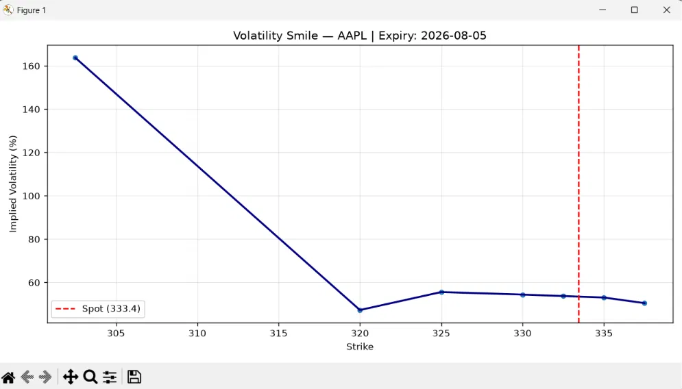
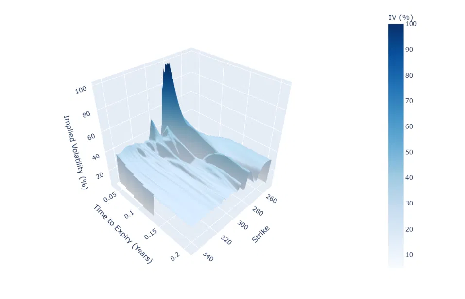
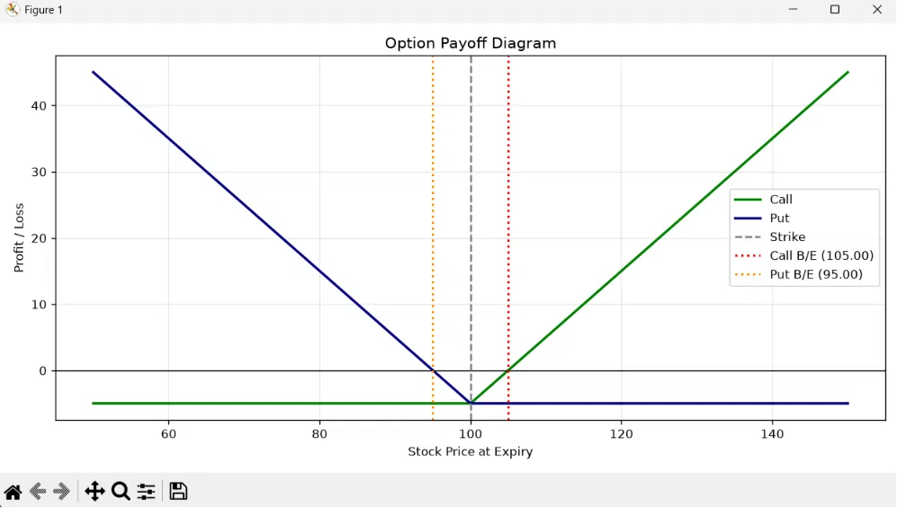
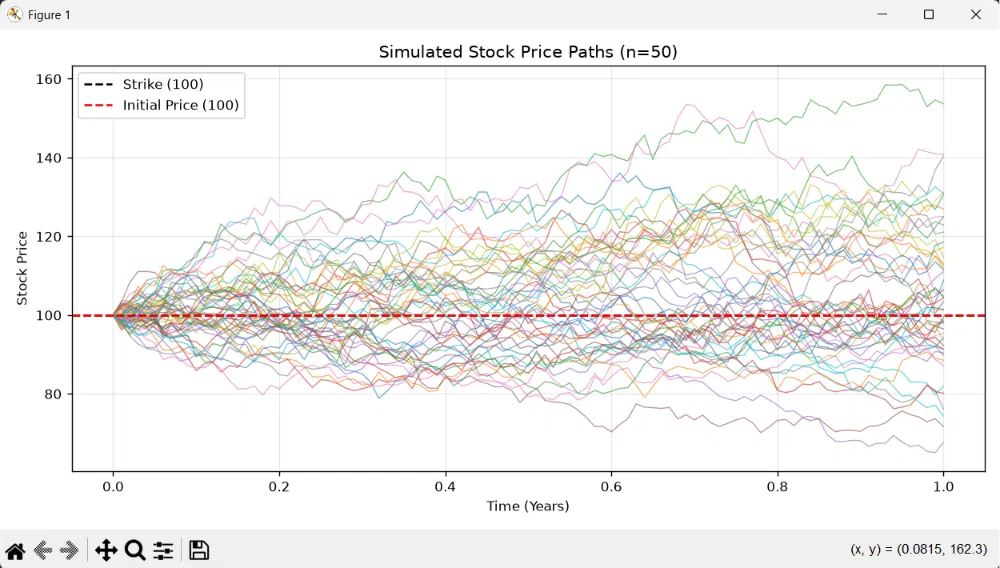
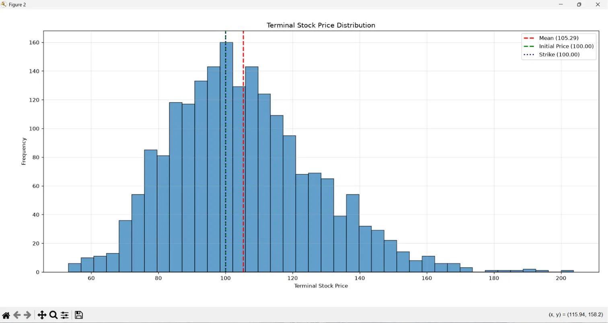
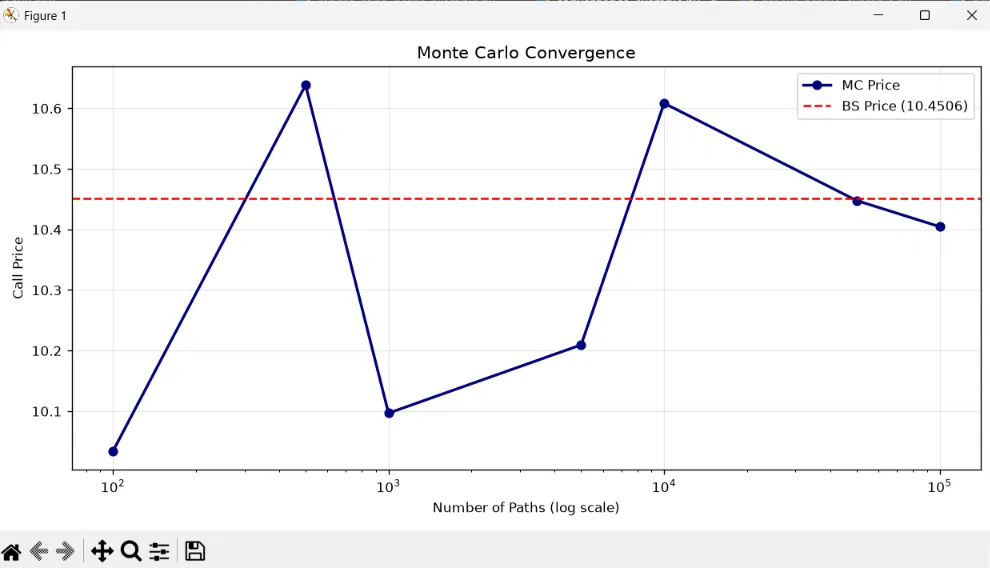
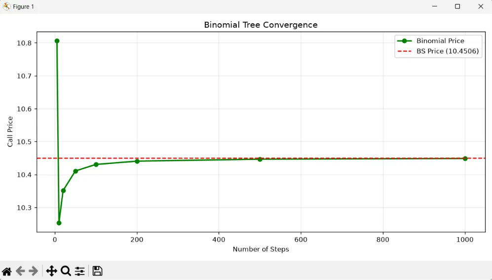

# Option Pricing

[](https://www.python.org/)
[](https://github.com/lightbender62/Option-pricing/tree/main/tests)
[](https://option-pricing-portal.vercel.app/)

[Live Demo](https://option-pricing-portal.vercel.app/) &nbsp;|&nbsp; [Documentation](https://option-pricing-portal.vercel.app/) &nbsp;|&nbsp; [GitHub](https://github.com/lightbender62/Option-pricing)

A Python library for pricing financial derivatives and performing quantitative finance analytics. It provides closed-form, tree-based, and simulation-based pricing engines for European, American, and exotic options, along with Greeks, implied volatility, and visualization tools.

## Contents

- [Why Option Pricing?](#why-option-pricing)
- [Companion Web Portal](#companion-web-portal)
- [Features](#features)
- [Installation](#installation)
- [Quick Start](#quick-start)
- [Supported Models](#supported-models)
- [Visualizations](#visualizations)
- [Validation](#validation)
- [Testing](#testing)
- [Project Structure](#project-structure)
- [Examples](#examples)
- [Documentation](#documentation)

## Why Option Pricing?

- A unified `call()` / `put()` interface across European, American, and exotic options, rather than a separate API for each.
- Multiple pricing engines, Black-Scholes, Binomial Tree, and Monte Carlo, accessible through a single consistent method signature.
- Built-in Greeks and implied volatility solving, without needing a separate analytics library.
- Publication-quality visualization tools for volatility structure, payoffs, and simulation output.
- An extensive automated test suite validating every pricing engine against known analytical results.

## Companion Web Portal

This package powers the pricing and analytics engine behind a full-stack web application that lets users price options and explore visualizations through a browser interface.

- Live Portal: [option-pricing-portal.vercel.app](https://option-pricing-portal.vercel.app/)
- Portal Repository: [github.com/lightbender62/Option-pricing-Portal](https://github.com/lightbender62/Option-pricing-Portal)

## Features

- **Pricing Models** —
Black-Scholes closed-form pricing, Binomial Tree pricing with early exercise support, and Monte Carlo simulation for path-dependent payoffs.

- **Option Types** —
European, American, and exotic options including Asian (arithmetic and geometric averaging), Barrier, and Lookback (floating and fixed strike).

- **Analytics** —
Full Greeks calculation (Delta, Gamma, Theta, Vega, Rho) and implied volatility solving from market prices.

- **Visualizations** —
Volatility smiles and surfaces, payoff diagrams, Monte Carlo simulated paths and terminal distributions, price heatmaps, Greeks profiles, and convergence analysis against analytical benchmarks.

- **Developer Experience** —
A consistent `call()` / `put()` interface across all option types, a `model=` parameter for selecting the pricing engine, and a full pytest suite covering correctness, convergence, and visualization output.

## Benchmark Results

The **Option Pricing** library was benchmarked locally to evaluate the computational performance of its pricing models and analytical utilities. Each benchmark was executed multiple times using identical input parameters, and the average execution time was recorded.

The results demonstrate the computational trade-offs between analytical, iterative, and simulation-based pricing methods. Analytical models such as **Black–Scholes** achieve execution times in the microsecond range, while iterative methods such as **Implied Volatility** require a few milliseconds. Numerical approaches including the **Binomial Tree** and **Monte Carlo** models exhibit higher execution times due to repeated computations and stochastic simulations, with Monte Carlo being the most computationally intensive.

| Component | Configuration | Average Runtime |
|-----------|---------------|----------------:|
| Black–Scholes | Analytical | **220.53 μs** |
| Greeks | Analytical | **598.43 μs** |
| Implied Volatility | Newton–Raphson | **1.698 ms** |
| Binomial Tree | 500 Steps | **157.255 ms** |
| Monte Carlo | 500 Steps, 100,000 Simulation Paths | **2995.353 ms** |

> **Benchmark Environment**
>
> - **Processor:** AMD Ryzen 7 (HP Omen)
> - **Operating System:** Windows 11
> - **Python Version:** Python 3.x
>
> Reported values represent the average execution time over multiple iterations on the above hardware configuration. Actual performance may vary depending on processor architecture, operating system, Python version, and workload configuration.

## Installation

Requirements: Python 3.10+, NumPy, SciPy, Matplotlib, Plotly, yfinance.

Clone the repository and install locally:

```bash
git clone https://github.com/lightbender62/Option-pricing.git
cd Option-pricing
pip install .
```

## Quick Start

```python
from option_pricing import EuropeanOption

option = EuropeanOption(S=100, K=100, T=1, r=0.05, sigma=0.2)

call_price = option.call()
put_price = option.put()

print(f"Call: {call_price:.4f}, Put: {put_price:.4f}")
```

```
Call: 10.4506
Put: 5.5735
```

Every option type shares the same interface. Switch pricing engines with the `model` parameter where supported:

```python
option.call(model="binomial", steps=500)
option.call(model="montecarlo", paths=100000)
```

Exotic options follow the same `call()` / `put()` pattern, with parameters specific to their payoff structure:

```python
from option_pricing import AsianOption, BarrierOption, LookbackOption

asian = AsianOption(S=100, K=100, T=1, r=0.05, sigma=0.2)
asian.call(average="arithmetic")

barrier = BarrierOption(S=100, K=100, T=1, r=0.05, sigma=0.2, H=120, barrier_type="up-and-out")
barrier.call()

lookback = LookbackOption(S=100, K=100, T=1, r=0.05, sigma=0.2)
lookback.call(strike_type="floating")
```

## Supported Models

| Model | Status | Description |
|---|---|---|
| European | Complete | Black-Scholes, Binomial Tree, and Monte Carlo pricing with full Greeks and implied volatility |
| American | Complete | Binomial Tree pricing with early exercise |
| Asian | Complete | Monte Carlo pricing with arithmetic and geometric averaging |
| Barrier | Complete | Monte Carlo pricing for knock-in and knock-out structures |
| Lookback | Complete | Monte Carlo pricing with floating and fixed strike variants |

## Visualizations

The package includes a dedicated `visualization` module for inspecting pricing behavior, volatility structure, and simulation output. Each plot below can be reproduced with the corresponding script in `examples/visualization/`.

### Volatility Smile



Implied volatility plotted against strike for a fixed expiry, derived from market option prices via the implied volatility solver.

### Volatility Surface



A full implied volatility surface plotted against strike and time to expiry, built from a grid of implied volatilities across multiple maturities.

### Option Payoff Diagram



Profit and loss at expiry for a call and put position, with strike and breakeven points marked.

### Simulated Stock Price Paths



Simulated underlying price paths under geometric Brownian motion, as used internally by the Monte Carlo pricing engine.

### Terminal Price Distribution



Distribution of simulated terminal prices at expiry across all Monte Carlo paths, shown against the initial price and strike.

### Monte Carlo Convergence



Call price computed by the Monte Carlo engine as the number of simulated paths increases, benchmarked against the Black-Scholes analytical price.

### Binomial Tree Convergence



Call price computed by the Binomial Tree engine as the number of steps increases, benchmarked against the Black-Scholes analytical price.

## Validation

Numerical pricing methods are validated against known analytical solutions. European option prices from the Binomial Tree and Monte Carlo engines are checked against the Black-Scholes closed-form price, with convergence confirmed as the number of steps or simulated paths increases.

The Binomial Tree converges smoothly and monotonically toward the Black-Scholes price as the number of steps grows. Monte Carlo pricing converges toward the same reference price as the number of simulated paths increases, though with visible variance at low path counts due to its stochastic nature.

Put-call parity and known reference values are also verified directly in the test suite.

## Testing

The package ships with a full `pytest` suite in the `tests/` directory, covering correctness, convergence, and visualization output for every pricing engine and option type.

Install the package in editable mode along with its development dependencies, then run the suite from the project root:

```bash
pip install -e ".[dev]"
pytest
```

The test suite is organized by component:

| Test file | Coverage |
|---|---|
| `test_black_scholes.py` | Closed-form pricing correctness, put-call parity, and limiting behavior |
| `test_binomial.py` | Binomial Tree pricing and convergence toward Black-Scholes |
| `test_monte_carlo.py` | Monte Carlo pricing, path simulation, and convergence behavior |
| `test_european_option.py` | `EuropeanOption` interface across all three pricing engines |
| `test_american_option.py` | `AmericanOption` pricing with early exercise |
| `test_exotic_options.py` | `AsianOption`, `BarrierOption`, and `LookbackOption` pricing |
| `test_greeks_and_iv.py` | Greeks calculation and implied volatility solving |
| `test_visualizations.py` | Correct generation of plots without runtime errors |

## Project Structure

```text
option_pricing/
├── _core/
│   ├── black_scholes.py
│   ├── binomial_model.py
│   ├── monte_carlo.py
│   └── analytics/
│       ├── greeks.py
│       └── implied_volatility.py
├── exotic/
│   ├── asian.py
│   ├── barrier.py
│   └── lookback.py
├── visualization/
│   ├── convergence.py
│   ├── greeks.py
│   ├── monte_carlo_visualization.py
│   ├── priceheatmap.py
│   ├── pricing_curves.py
│   ├── vol_surface.py
│   └── payoffs/
├── base.py
├── european.py
├── american.py
└── __init__.py

examples/
├── pricing/
├── analytics/
└── visualization/

tests/
docs/
```

## Examples

The `examples/` directory contains runnable scripts demonstrating each part of the package:

| Folder | Contents |
|---|---|
| `pricing` | European, American, Asian, Barrier, and Lookback option pricing |
| `analytics` | Greeks calculation and implied volatility solving |
| `visualization` | Volatility smiles and surfaces, payoff diagrams, Monte Carlo paths, price heatmaps, pricing curves, and convergence analysis |

## Documentation

Theory notes covering Black-Scholes, Itô calculus, stochastic processes, and the Greeks are available in `docs/Theory/`. API usage and worked examples can be found in the `examples/` directory and the pytest suite in `tests/`. Full API documentation and interactive examples are also available on the companion web portal linked above.
